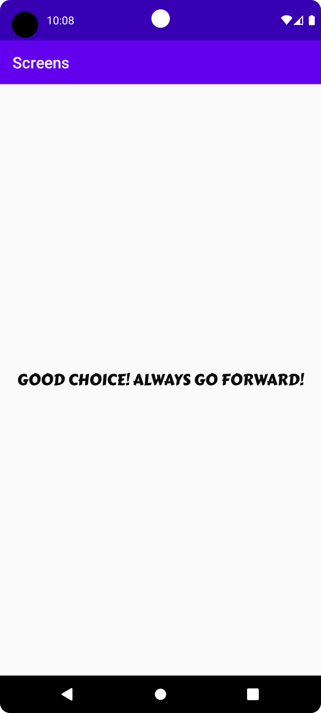
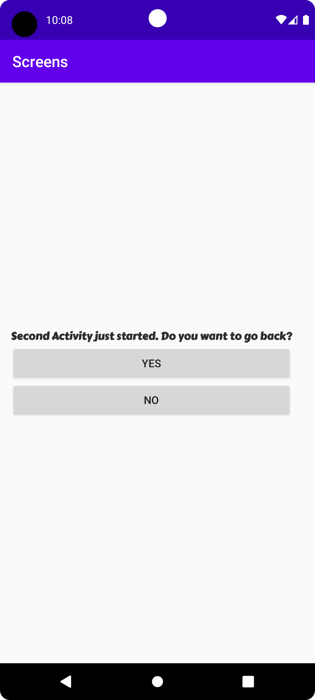
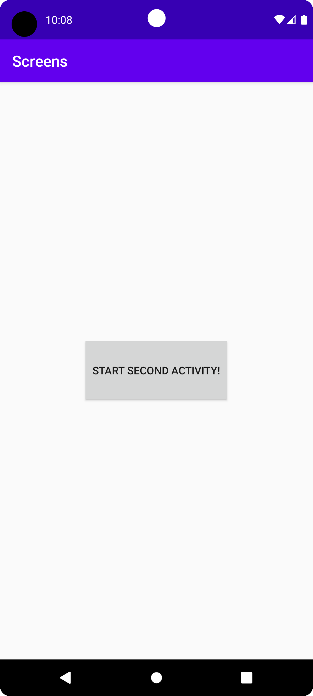

# Rapport

## Add a second activity

Högerklickade på `java` mappen. Valde `New` > `Activity`> `Empty Activity`. Döpte 
till `SecondActivity` och en ny javafil skapades samt en `activity_second.xml` undet layout. 

## Add a button in the first activity that starts the second activity

Bytte ut `Textview` till `Button` i `activity_main.xml` filen. Gav button ett id och bytte texten 
från `Hello World!`till `Start SecondActivity`. 

Kod för knappen: 

```
<Button
    android:id="@+id/button"
    android:layout_width="wrap_content"
    android:layout_height="wrap_content"
    android:text="Start SecondActivity"
    app:layout_constraintBottom_toBottomOf="parent"
    app:layout_constraintLeft_toLeftOf="parent"
    app:layout_constraintRight_toRightOf="parent"
    app:layout_constraintTop_toTopOf="parent" />
```

Skapade även kod i `MainActivity` för att dels skapa variabeln button men också för att
skapa en interagerbar UI-komponent en Onclick, i detta fall en knapp, se nedan kod: 

```
    @Override
    protected void onCreate(Bundle savedInstanceState) {
        super.onCreate(savedInstanceState);
        setContentView(R.layout.activity_main);

        Button button = findViewById(R.id.button);
        button.setOnClickListener(new View.OnClickListener() {
            @Override
            public void onClick(View view) {
                Log.d("TAG" , "Starta SecondActivity");
            }
        });
    }
```

För att sedan navigera från MainActivity till SecondActivity behövdes en intent läggas till 
i koden. Intent är till för att starta aktiviteten. I koden skrivs vart den startar ifrån och 
vilken den ska till. 

Kod som lades till:
```
     @Override
     public void onClick(View view) {
        Log.d("TAG" , "Starta SecondActivity");

        Intent intent = new Intent(MainActivity.this, SecondActivity.class);
        startActivity(intent);
     }
```

## Add data to the intent bundle using extras
I Second Activity skapades två knappar, båda fick metoden onClick. Den första knappen "goback" (NO),
användes kod för att stänga `Second Activity`  genom funktionen finich() och då kommer man tillbaka 
till `MainActivity`.

Kod:

```
Button goback = findViewById(R.id.goback);
goback.setOnClickListener(new View.OnClickListener() {
     @Override
     public void onClick(View v) {
        Log.d("SCREEN2", "goback");
        finish();
     
```
Den andra knappen "goforward" (NO) fick data som skickades vidare till `Third Activity` via funktionen
extra i detta fall intent.putExtra. 

Kod: 

```
Button goforward = findViewById(R.id.goforward);
goforward.setOnClickListener(new View.OnClickListener() {
    @Override
    public void onClick(View view) {
        Log.d("SCREEN2" , "Start ThirdActivity");

         Intent intent = new Intent(SecondActivity.this, ThirdActivity.class);
         intent.putExtra("name", "GOOD CHOICE! ALWAYS GO FORWARD!");
         startActivity(intent);
     }
});
```







